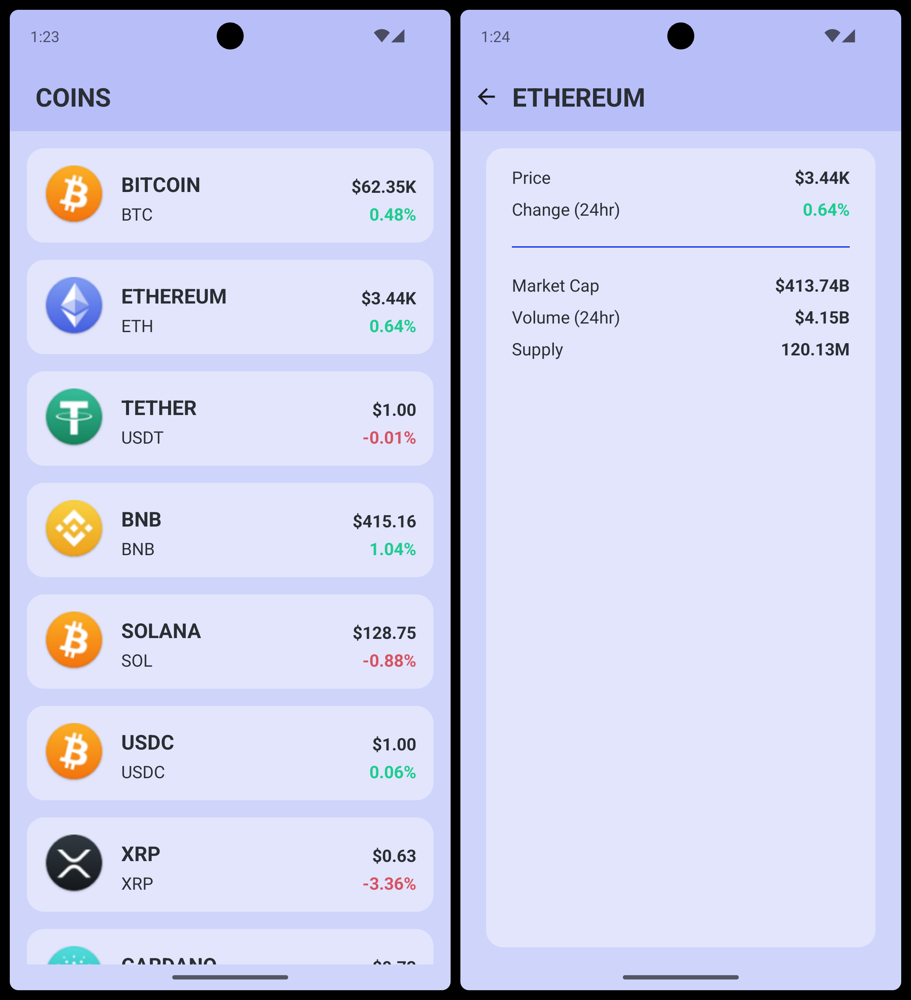

# Crypto Coins app

This small Android application shares information on cryptocurrencies in the market.




## How to build and run

### From the terminal

To only build a debug APK, navigate to the root folder of the project in the terminal and execute the following command:
```
./gradlew assembleDebug
```

You can then manually install it via `adb` or alternative methods.


If you want to build & install the APK in a single step, please use this command:
```
./gradlew installDebug
```

### From Android Studio

By default, the `debug` Build Variant should be selected after opening the project in Android Studio. If this is not the case, please select it before building the project. The same applies to the Run Configurations: the `app` should be selected.

To build, install and run the APK, you only have to click on the green Play icon on the toolbar and wait until Gradle finishes its tasks. If you have an emulator set up, or a physical device (with USB debugging enabled) connected to your machine, the app will be installed and run after the build finishes.
